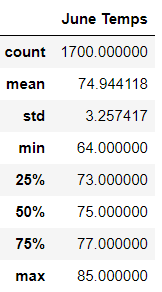
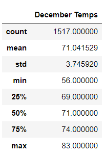
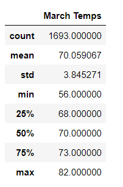
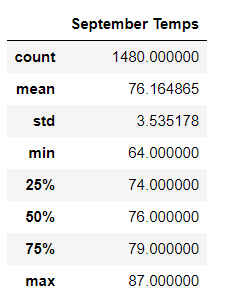
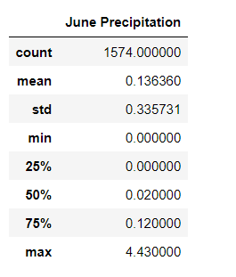

# Surfs Up!
## Overview 
We will use SQLite to analyze a weather dataset to understand if a Surf and Shake shop will make a good investment in this area.
### Purpose
W. Avy has asked us to make an analyzes on weather for the area to understand if a new shop will survive the weather. We will use SQLite and Jupyter Notebook to create our analyzes and creat an Flask app to take a look at weather year round in this area.
### Results
In our analyses we created DataFrames from two point throughout the year: June and December. We performed statistical analyzed on each months temperatures. Each are displayed below: 
 
                       
 
We can determine the following from the comparing the two:
- We can determine that there were more temperatures accounted for the month of december which may have influence on the statistical statistics between the two months
- We can see December has a much lower minimum temperature of 56 degrees as compared to June's minimum temperature of 64
- We can also see that June as not much higher maximum temperature of 77 degrees as compared to December's 74 degrees

 
### Summary:
Based on our queries on the temperature for June and December we can advice our client that the Surf and Shake ice cream shop will be successful. We see that both months have average temperatures in the 70s. These two queries show that the shop will sell well in this weather at two different points in the year. We can also perform additional queies to find more information about the weather. We can also run analysis on March and Septemper to understand the weather in Spring and Fall. We can run an analysis on the precipitation to see what areas might not show the best weather.
 
We see the following results for March and September:
 
                       
 
We see in each of these analysis that both months show excellent temperatures for the Surf and Shake shop.
 
We can run a query on precpitation for both months as shown below:
 
                       
 
From these queries we can further suggest that their shop can survive the weather for this location. We see December has a max precipitation of 6.42 but only a mean of .22. In June we see that there is a max precipitation of 4.43 and only a mean of .14 . Precipitation for both months is relatively low and a great location for fun.
